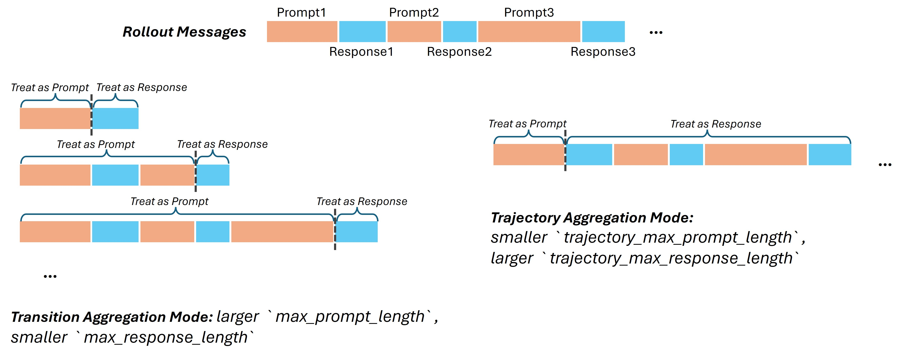
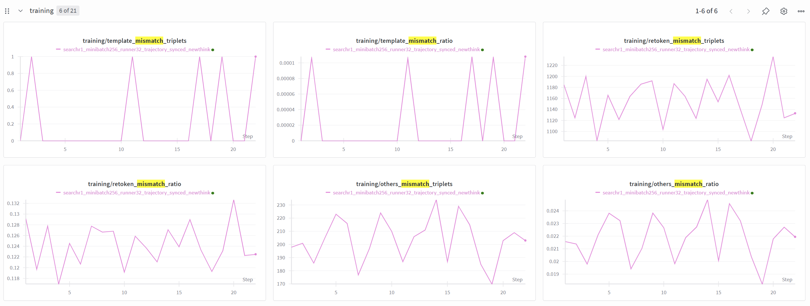

+++
date = '2025-11-28T00:00:00+08:00'
draft = false
title = 'Adopting the Trajectory Aggregation Mode for Faster Training'
tags = ['agent rl', 'reinforcement learning', 'agent lightning', 'ai agent']
+++

# Adopting the Trajectory Aggregation Mode for Faster Training

*Agent Lightning (AGL) Team*
*Date: Nov. 2025*

## 1. Introduction

In the context of Multi-turn Agent Reinforcement Learning (RL), data collection relies on **rollouts** where an agent interacts with an environment over multiple sequential turns. The strategy used to process these rollouts into training samples is a critical architectural decision that fundamentally impacts both training efficiency and model performance.

Currently, **Agent Lightning** supports two primary strategies for aggregating these interaction traces: **Transition Aggregation** and **Trajectory Aggregation**.

### Transition Aggregation Mode

**Configuration:** (Default) `actor_rollout_ref.trace_aggregator.mode = transition`

In **Transition Aggregation Mode**, every individual response generated during a multi-turn session is treated as a distinct, independent training sample.

* **Structure:** For a single session containing N turns, this mode generates N separate training samples.
* **Masking:** For any given sample, only the newly generated response (the current turn) is assigned a `response_mask=1` (active loss). The entire preceding conversation history is treated as frozen context (`response_mask=0`).
* **Characteristics:** While this approach is simple to implement and robust against tokenization errors, it results in a dataset with a high sample count where each sample duplicates the shared history prefix. This leads to significant computational redundancy (re-computing KV caches for the same history multiple times) and increased memory overhead.

### Trajectory Aggregation Mode

**Configuration:** `actor_rollout_ref.trace_aggregator.mode = trajectory`

**Trajectory Aggregation Mode** processes the entire multi-turn interaction session as a single, contiguous training sample. This is the standard approach in the broader landscape of Large Language Model (LLM) pre-training and fine-tuning.

* **Structure:** A session with N turns is condensed into one long-sequence sample.
* **Masking:** The sample utilizes an alternating mask pattern. User prompts and environment observations are masked (`response_mask=0`), while all agent responses within the sequence are active (`response_mask=1`).
* **Efficiency Gains:** By processing the full trajectory at once, we eliminate redundant computation on history prefixes and maximize GPU utilization through longer sequence lengths. This significantly accelerates training throughput.

**Scope:** This implementation applies specifically to **multi-turn message** scenarios, where the message history from previous turns is fed into the model as context for the subsequent turn.


---

## 2. Trajectory Mode in Agent-Lightning

### Implementation Logic

The foundational implementation of **Agent Lightning** was originally designed around the *transition mode*. Consequently, adopting the Trajectory Mode requires a fundamental shift in how training data is constructed. The core logic involves three distinct steps:

1. **Trace Merging:** Consolidate the discrete interaction logs (traces) received from the environment into a continuous conversation history string. Crucially, this requires identifying the exact start and end positions of each agent response within the merged text via **Prefix Matching**.
2. **Response Masking:** Construct the final training trajectory by applying an alternating `response_mask` (assigning `0` for prompts/observations and `1` for agent responses).
3. **Training:** Feed the fully constructed, masked trajectory into the model for optimization.

### Configuration Parameters

To enable and control Trajectory Mode, specific parameters must be configured in your YAML file under `actor_rollout_ref`:

```yaml
actor_rollout_ref:
  rollout:
    trace_aggregator:
      mode: trajectory  # 'transition' or 'trajectory'
      
      # Maximum length for the prompt in first turn
      trajectory_max_prompt_length: 2048
      
      # Maximum length for the cumulative agent responses in the full trajectory
      trajectory_max_response_length: 8192
      
      debug: False  # Enable to diagnose trace merging failures
      unmatch_log_dir: ./unmatch_cases  # Directory to store logs of unmatched cases

```

**Note on Length Constraints:**
Because the data structure differs from transition mode, you must explicitly set:

* `trajectory_max_prompt_length`
* `trajectory_max_response_length`

The standard `max_prompt_length` and `max_response_length` parameters **still remain effective**. They continue to constrain the input/output lengths of *single turns* during the inference/rollout phase. The new `trajectory_*` parameters constrain the final concatenated training sample. A good rule of thumb is to set `trajectory_max_response_length` to approximately N_{turns} \times (L_{response} + L_{prompt}).




### Debug Mode

In Trajectory Mode, it is possible that—even if information is accumulated sequentially—the system fails to perfectly merge the rollout logs into a single training sample (reasons detailed in Section 3).

Agent Lightning provides a **Debug Mode** to monitor this stability.

* **Metric:** We provide a metric tracking the percentage of rollouts that failed to merge into a valid trajectory.
* **Deep Dive (`debug=True`):** When enabled, the aggregator analyzes every rollout. It calculates the ratios of three specific types of mismatches (see below) and logs the specific text cases causing failures to `unmatch_log_dir`.

**Performance Warning:** Enabling `debug=True` requires `tokenizer.decode` operations during the data processing pipeline. This adds significant overhead to the post-processing step and will noticeably increase total generation time. Use only for troubleshooting.



---

## 3. Trace Merging Failures: A Deep Dive

The primary obstacle in implementing Trajectory Mode is the failure of **Prefix Matching** during the Trace Merging stage. Ideally, we would locate the agent's response within the full conversation by matching the token sequence generated during inference.

However, in practice, the token IDs stored during the rollout (inference) often do not match the token IDs produced when the full history is re-tokenized for training. This is because the mapping from `String` \to `Token IDs` is not bijective; it is context-dependent. The cycle of **ID (Generation) \to String (Detokenization) \to ID (Retokenization)** introduces drift.


### 3.1 Contextual Retokenization Discrepancy & BPE Artifacts (Retoken Mismatch)

Tokenization algorithms (like BPE) merge characters based on frequency and context. A text segment generated sequentially token-by-token can result in different IDs than the same text processed as a whole block.

**Sub-Word Split Variability**

* **The "Think Tag" Fragmentation:** This issue is particularly prevalent in models that are instructed via prompts to use structural tags (e.g., `<think>...</think>`) for Chain-of-Thought reasoning, but **do not** possess these tags as atomic special tokens in their vocabulary.
* *Generation:* The model generates the tag as a sequence of separate standard tokens (e.g., `["<", "think", ">"]`).
* *Retokenization:* When the full history is processed as a block, the tokenizer's BPE algorithm often aggregates these characters differently (e.g., splitting as `["<th", "ink", ">"]`) or merging them with adjacent punctuation. Since the sequence of Token IDs changes between generation and re-tokenization, the prefix matcher fails to locate the response boundaries.

* **The "HAVING" Example:** During generation, a model might output the word "HAVING" as two separate tokens: `H` (ID: 35) + `AVING` (ID: 482). However, when this text is detokenized into the string "HAVING" and then re-tokenized as part of a prompt, the tokenizer might prefer the split `HAV` (ID: 982) + `ING` (ID: 27).

* **Result:** Although the human-readable text is identical, the token ID sequences differ. The system cannot "find" the response sequence inside the re-tokenized history, causing the masking logic to fail.


**Special Tokens Hallucination**

Occasionally, models may hallucinate or "spell out" special tokens rather than generating the single atomic ID.

* **Issue:** A model might generate the string `<reserved_token_xx>` character-by-character (resulting in multiple token IDs). However, during re-tokenization, the tokenizer recognizes this string as a reserved keyword and collapses it into a single special token ID.
* **Result:** This creates a discrepancy in token counts (e.g., 10 tokens generated vs. 1 token re-tokenized), causing significant misalignment in the mask indices.


### 3.2 Retokenization Drift Caused by Chat Templates (Template Mismatch)

The mechanism used by Chat Templates to demarcate individual turns introduces boundary artifacts.

**Special Token Mismatch**
Chat templates are often irreversible regarding special tokens. During inference, the LLM may explicitly generate an end-of-turn token like `<end_of_text>`. However, when this content is fed back into the chat template for the next turn, the template might strip this token or convert it into a newline, meaning the training data lacks the EOS token present in the rollout.

**Cross-turn Boundary Tokenization**
When responses are concatenated with subsequent prompts, the tokenizer may merge tokens across the boundary.

* **Example:** If an agent response ends with `!` and the template appends `\n\n` for the next turn, the sequence `!\n\n` might be tokenized as a single, new token.
* **The Dilemma:** This single token technically contains part of the *Response* (should be mask=1) and part of the *Template* (should be mask=0). It is impossible to correctly assign a binary mask to this "hybrid" token.


### 3.3 Agent Post-processing Modifications (Others Mismatch)

Many production agents employ post-processing logic to refine outputs before presenting them to the environment or user.

* **Issue:** An agent might generate a "Chain of Thought" followed by a final answer, but a regex post-processor might truncate the thought process to keep only the final answer for the next turn's history.
* **Result:** The stored rollout data (full generation including thoughts) no longer matches the prompt prefix used in the subsequent turn (truncated history). The prefix matcher looks for content that technically no longer exists in the history.


### 3.4 Normalization Artifacts (Others Mismatch)

Minor artifacts often invisible in standard string views can cause drift.

* **Issue:** During re-tokenization, additional whitespace, escape characters (e.g., `\n` vs `\\n`), or unicode normalization variances may be introduced.
* **Result:** These subtle changes shift the token boundaries, rendering the original stored indices invalid.

---

## 4. Best Practices & Recommendations

To successfully adopt Trajectory Mode and minimize data loss, we recommend the following:

1. **Configure Lengths Correctly:** Ensure `trajectory_max_prompt_length` and `trajectory_max_response_length` are sufficient to hold the *sum* of all turns in a session. Undersizing these will lead to truncation and invalid trajectories.
2. **Audit Post-Processing:** If your agent pipeline includes post-processing (truncation, regex cleaning, formatting), ensure this logic is accounted for. If the history fed to the model differs from the raw generation log, trace merging will fail.
3. **Monitor with Debug Mode:** If you observe a high rate of unmerged rollouts:
* Enable `debug=True` temporarily.
* Check `unmatch_log_dir` for patterns.
* Look specifically for "Thinking" artifacts or specific punctuation causing BPE splits at turn boundaries.
* You may need to adjust your Prompt Engineering or Chat Template to encourage "cleaner" token boundaries (e.g., forcing a newline at the end of a generation).
